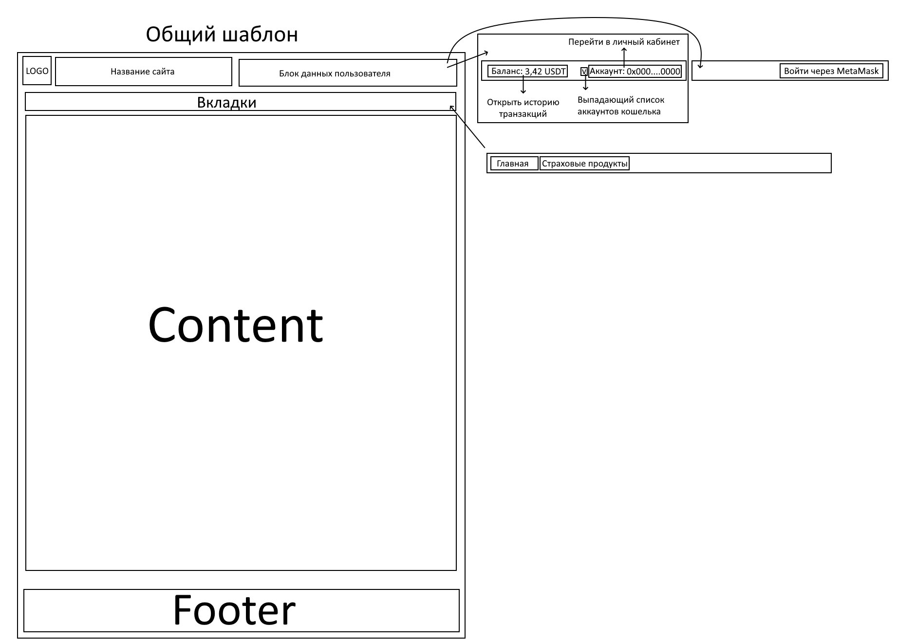
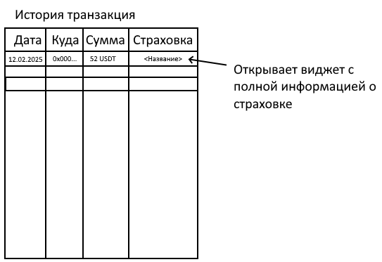
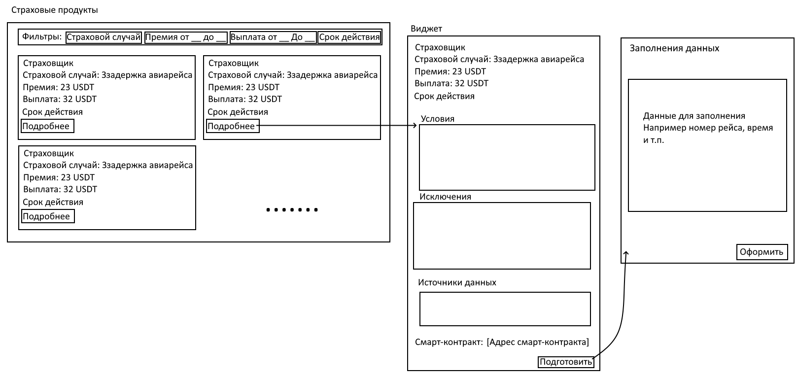
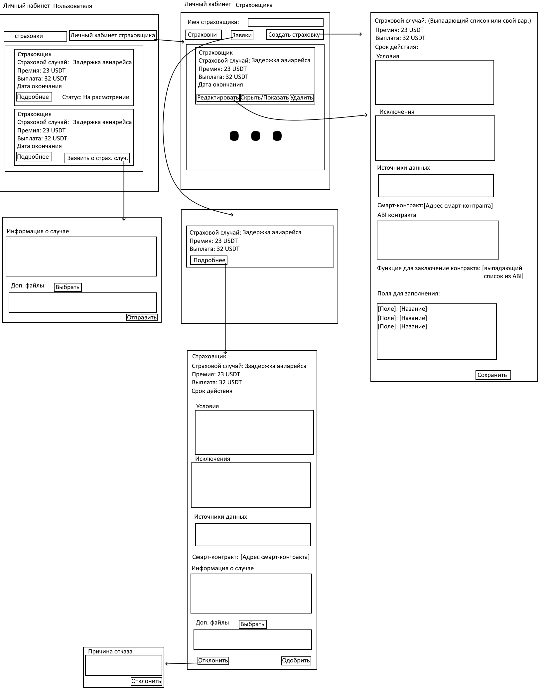

# Оглавление

- [Оглавление](#оглавление)
- [Вариант 18](#вариант-18)
- [ТЗ](#тз)
  - [Выбор блокчейн-решения с обоснованием и указанием используемого механизма консенсуса](#выбор-блокчейн-решения-с-обоснованием-и-указанием-используемого-механизма-консенсуса)
  - [Подробное техническое задание](#подробное-техническое-задание)
    - [Цель проекта:](#цель-проекта)
    - [Основные функциональные требования:](#основные-функциональные-требования)
    - [Нефункциональные требования:](#нефункциональные-требования)
  - [Основные функциональные модули системы и их взаимосвязь](#основные-функциональные-модули-системы-и-их-взаимосвязь)
  - [Основные используемые механизмы блокчейн-системы](#основные-используемые-механизмы-блокчейн-системы)
    - [Транзакции:](#транзакции)
    - [Блоки:](#блоки)
    - [Генезис-блок:](#генезис-блок)
    - [Смарт-контракты:](#смарт-контракты)
      - [Подробное описание работы смарт-контрактов в системе:](#подробное-описание-работы-смарт-контрактов-в-системе)
  - [Стек технологий для разработки](#стек-технологий-для-разработки)
  - [Планирование задач, распределение между участниками и временной график](#планирование-задач-распределение-между-участниками-и-временной-график)
    - [Команда проекта:](#команда-проекта)
  - [Эскизы интерфейса будущего блокчейн-решения](#эскизы-интерфейса-будущего-блокчейн-решения)

# Вариант 18

Перед разработчиком стоит задача: 
Сформулировать задачу для решения которой необходимо применить блокчейн-решение и спроектировать схему решения.

Необходимо отразить следующие моменты:
1. Выбор (с обоснованием) блокчейн-решения с указанием используемого механизма консенсуса.
2. Разработать подробное техническое задание.
3. Указать основные функциональные модули системы и показать их взаимосвязь. Отдельное внимание уделить модулю авторизации в системе.
4. Отразить основные используемые механизмы блокчейн системы (например: транзакции, блоки, генезисблок, смарт-контракты и т.д.). Каждый механизм рассмотреть подробно и  выполнить его детальное описание.
5. Определить и обосновать стек технологий, который предполагается использовать для разработки
6. Определить все задачи, которые необходимо решить для выполнения поставленного технического задания, распределить задачи между участниками и спланировать их по времени. Обосновать полученный результат.
7. Представить эскизы интерфейса будущего блокчейн решения.

Комментарий:
- не обязательно использовать платформу Ethereum, необходимо подобрать платформу, которая оптимально решит поставленные задачи
- стек технологий не должен ограничиваться вашими навыками, необходимо подобрать технологии, которые оптимально решат поставленные задачи
- платформа не обязательно должна поддерживать работу с криптовалютой, токен ERC-20 реализуется как типовой смарт-контракт с программируемыми балансами в рамках бизнес-логики

Децентрализованная платформа для страхования. Разработайте плафторму для системы страхования, где пользователи могут заключать страховые контракты и получать выплаты за токены ERC-20. 
Учет в системе (обязательно): Хранение балансов страхователей и страховщиков, история транзакций, учет условий страхования.

# ТЗ

## Выбор блокчейн-решения с обоснованием и указанием используемого механизма консенсуса

**Для наших целей подходит Ethereum L2 так как он:**

- Поддерживает смарт-контракты
- Высоко децентрализирован
- Энергоэффективен
- Родной блокчейн для стандарта ERC-20
- Имеет более низкие комиссии по сравнению с Ethereum L1

Как аналог можно выделать Polygon (MATIC), так как у него низкие комиссии и быстрая скорость транзакций. Но так как мы работаем с деньгами клиентов, то нам нужна высокая безопасность за счёт высокой децентрализованности, чем Polygon похвастаться не может, так как это сайдчейн.

**Ethereum работает с консенсусом: Proof of Stake (PoS)**

PoS позволяет участникам сети (валидаторам) подтверждать транзакции и добавлять новые блоки в блокчейн, используя свои собственные монеты в качестве залога. Это снижает энергопотребление и повышает скорость обработки транзакций по сравнению с Proof of Work (PoW).

## Подробное техническое задание

### Цель проекта:

Разработать децентрализованную платформу страхования на базе блокчейна Ethereum, которая позволяет пользователям:

- Заключать страховые контракты с страховщиками.
- Получать страховые выплаты в токенах ERC-20.
- Отслеживать балансы и историю транзакций.
- Управлять и просматривать условия страхования.

<!-- Смарт-контракты для страхования в рамках платформы:
- договор страхования при задержке авиарейса
- договор страхования при природных катастрофы -->

### Основные функциональные требования:

1. **Регистрация и авторизация пользователей:**

   - Аутентификация через Ethereum-кошелек (например, MetaMask).
   - Поддержка ролей пользователей: страхователи и страховщики.

2. **Управление страховыми продуктами:**

   - Страховщики могут создавать и настраивать страховые продукты.
   - Указание условий страхования, премий и выплат.

3. **Заключение страховых контрактов:**

   - Страхователи могут выбирать страховые продукты и заключать контракты.
   - Оплата страховых премий в токенах ERC-20 через смарт-контракты.

4. **Обработка страховых случаев:**

   - Ручная обработка страхового случая через заяки.
   - Выплаты страховых компенсаций через смарт-контракты.

5. **Финансовый модуль:**

   - Управление балансами пользователей.
   - История транзакций и операций.

6. **Учет условий страхования:**

   - Хранение условий каждого страхового контракта в блокчейне.
   - Возможность просмотра и проверки условий в любое время.

### Нефункциональные требования:

- **Безопасность:**

  - Использование безопасных смарт-контрактов с аудитом кода.
  - Шифрование данных и защита от несанкционированного доступа.

- **Масштабируемость:**

  - Оптимизация смарт-контрактов для минимизации газовых комиссий.
  - Возможность обработки большого количества одновременных пользователей.

- **Юзабилити:**

  - Интуитивно понятный интерфейс для пользователей с разным уровнем технической подготовки.
  - Адаптивный дизайн для различных устройств.

## Основные функциональные модули системы и их взаимосвязь

1. **Модуль авторизации и аутентификации:**

   - **Описание:** Обеспечивает безопасный вход пользователей в систему через Ethereum-кошельки.
   - **Взаимосвязи:** Связан с пользовательским интерфейсом и смарт-контрактами для проверки прав доступа.

2. **Модуль управления страховыми продуктами:**

   - **Описание:** Позволяет страховщикам создавать и редактировать страховые продукты.
   - **Взаимосвязи:** Взаимодействует с базой данных условий страхования и смарт-контрактами.

3. **Модуль заключения контрактов:**

   - **Описание:** Обеспечивает процесс заключения страховых контрактов между страхователями и страховщиками.
   - **Взаимосвязи:** Интегрирован со смарт-контрактами, модулем платежей и пользовательским интерфейсом.

4. **Модуль заявок на обработку страхового случая:**

   - **Описание:** Система заявок между пользователем и страховщиком.
   - **Взаимосвязи:** Работает со смарт-контрактами и модулем уведомлений.

5. **Финансовый модуль:**

   - **Описание:** Управляет балансами пользователей и историей транзакций.
   - **Взаимосвязи:** Связан с модулем платежей и смарт-контрактами.

6. **Модуль пользовательского интерфейса:**

   - **Описание:** Предоставляет пользователям доступ к функционалу системы через веб-приложение.
   - **Взаимосвязи:** Интегрирован со всеми модулями для отображения данных и действий.

**Особое внимание модулю авторизации:**

- Использует Ethereum-кошельки для аутентификации, что обеспечивает высокий уровень безопасности.
- Не требует хранения личных данных пользователей на сервере.
- Проверяет роль пользователя (страхователь или страховщик) для предоставления соответствующего функционала.

## Основные используемые механизмы блокчейн-системы

### Транзакции:

- Представляют собой записи в блокчейне о перемещении токенов или вызове функций смарт-контрактов.
- Содержат информацию о отправителе, получателе, сумме и данных для смарт-контракта.
- Подписываются приватным ключом отправителя для обеспечения безопасности и подлинности.

### Блоки:

- Содержат группу транзакций, объединенных вместе.
- Каждый блок имеет заголовок с метаданными (хэш предыдущего блока, временная метка, номер блока и т.д.).
- Добавляются в цепочку блоков (блокчейн) после подтверждения валидаторами.

### Генезис-блок:

- Первый блок в блокчейне, с которого начинается вся история цепочки.
- Устанавливает основные параметры сети и служит точкой отсчета для всех последующих блоков.

### Смарт-контракты:

- Программные коды, выполняемые в блокчейне Ethereum.
- В контексте платформы страхования используются для:
  - Заключения и хранения условий страховых контрактов.
  - Управления платежами и балансами пользователей.

#### Подробное описание работы смарт-контрактов в системе:

1. **Создание страхового продукта:**

   - Страховщик развертывает смарт-контракт с условиями страхования.
   - Условия включают страховую премию, сумму выплаты, сроки и другие параметры.

2. **Заключение страхового контракта:**

   - Страхователь взаимодействует со смарт-контрактом, оплачивая страховую премию в токенах ERC-20.
   - Смарт-контракт записывает факт заключения договора и связывает его с адресом страхователя.

3. **Обработка страхового случая:**

   - Пользователь заявляет о страховом случае через заявку.
   - Страховщик проверяет и подтверждает заявку.

## Стек технологий для разработки

- **Блокчейн-платформа:** Ethereum.

- **Языки программирования:**
  - **Solidity:** Для разработки смарт-контрактов.
  - **JavaScript:** Для фронтенда и взаимодействия с блокчейном.

- **Фреймворки и инструменты:**
  - **Ethers.js:** Библиотека для взаимодействия с Ethereum из JavaScript-приложений.
  - **React:** Фреймворк для создания пользовательского интерфейса.
  - **Django:** Для разработки серверной части.

- **Интеграции:**
  - **MetaMask:** Для аутентификации пользователей и подписания транзакций.

**Обоснование стека:**

- **Solidity** является стандартом для разработки смарт-контрактов на Ethereum.
- **JavaScript** широко используются в веб-разработке и имеют хорошие библиотеки для взаимодействия с блокчейном.
- **React** обеспечивают гибкость и скорость разработки пользовательского интерфейса.
- **MetaMask** упрощает процесс аутентификации и взаимодействия с блокчейном для пользователей.

## Планирование задач, распределение между участниками и временной график

### Команда проекта:

- **Проектный менеджер (ПМ):** Координация работы команды, управление сроками и ресурсами.
- **Блокчейн-разработчик (БР):** Разработка и тестирование смарт-контрактов.
- **Фронтенд-разработчик (ФР):** Создание пользовательского интерфейса.
- **Бэкенд-разработчик (БэкР):** Интеграция фронтенда со смарт-контрактами, настройка серверной части (если требуется).
- **Тестировщик (Т):** Тестирование функционала, поиск и отчет об ошибках.
- **Дизайнер (Д):** Разработка эскизов и макетов интерфейса.

**Основные задачи и сроки:**

1. **Подготовительный этап (1-2 недели):**
   - Дизайн интерфейса (Д):

2. **Разработка смарт-контрактов (3-5 недели):**

   - Проектирование архитектуры смарт-контрактов (БР).
   - Написание и тестирование смарт-контрактов (БР, Т).

3. **Разработка фронтенда (3-6 недели):**

   - Создание пользовательского интерфейса на основе дизайна (ФР).
   - Интеграция с MetaMask и настройка авторизации (ФР, БэкР).

4. **Интеграция и бэкенд (5-7 недели):**

   - Связь фронтенда со смарт-контрактами через Web3.js/Ethers.js (БэкР).
   - Настройка серверной части для дополнительных функций (Хранение балансов страхователей и страховщиков, история транзакций, учет условий страхования) (БэкР).

5. **Тестирование и отладка (6-8 недели):**

   - Полное тестирование системы (Т).
   - Исправление ошибок и оптимизация (все разработчики).

6. **Подготовка к запуску (8-9 недели):**

   - Развертывание смарт-контрактов в основной сети (БР).
   - Развертывание веб-приложения (ФР, БэкР).

## Эскизы интерфейса будущего блокчейн-решения

**Общий шаблон**

**Страница "История транзакций":**

**Страница "Страховые продукты":**

**Страница "Личный кабинет":**
